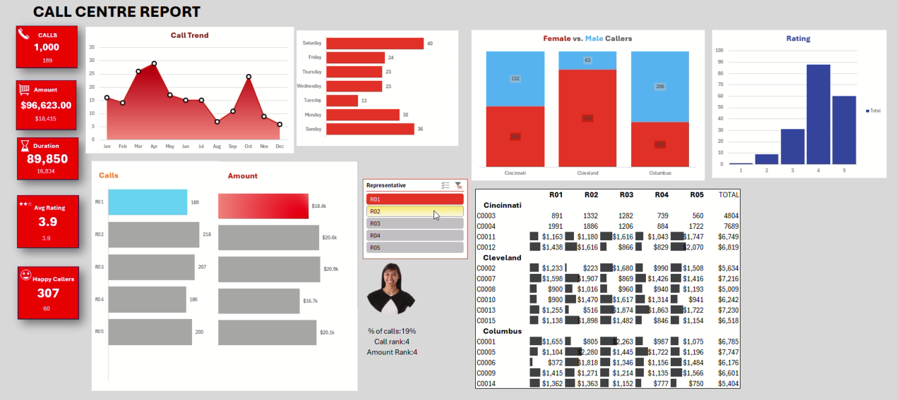

# 📊 Call Centre Report Dashboard

This project is an **interactive Excel dashboard** built to analyze call centre performance.  
It provides insights into call volume, revenue, customer satisfaction, and representative efficiency.  

---

## 🖼️ Dashboard Preview

---

## 📂 Files in this Repository
- `07.sample-data-excel-portfolio-project.xlsx` → Main Excel dashboard  
- `Screen Recording 2025-08-20 001250.mp4` → Demo walkthrough video  

---

## 🔑 Features
- ✅ **KPIs at a glance** → Calls, Amount, Duration, Avg. Rating, Happy Callers  
- 📈 **Call Trend Analysis** → Monthly call patterns  
- 👩‍💻 **Representative Performance** → Calls & revenue by rep  
- ⚖️ **Gender Insights** → Female vs. Male caller breakdown  
- ⭐ **Customer Feedback** → Ratings distribution  
- 🏙️ **Regional Insights** → Cincinnati, Cleveland, Columbus reports  

---

## 🛠️ Tools & Skills Used
- Microsoft Excel
- Pivot Tables & Charts
- Slicers & Filters
- Conditional Formatting
- Data Visualization & Dashboard Design

---

## 🚀 How to Use
1. Download the Excel file from this repo.  
2. Open it in **Microsoft Excel (2016 or later)**.  
3. Interact with slicers & filters to explore the data.  

---

---

## 📌 About
This project was created as part of my **Excel Portfolio** to showcase dashboard design and data visualization skills.  

